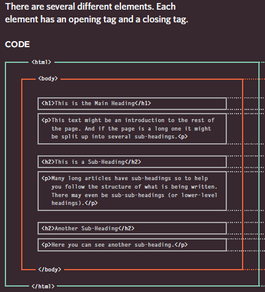
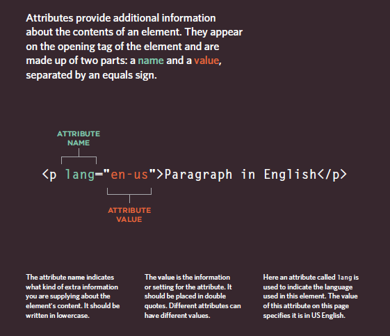
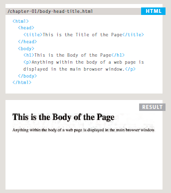
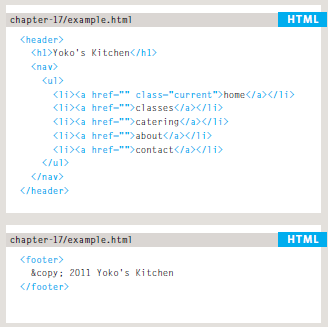
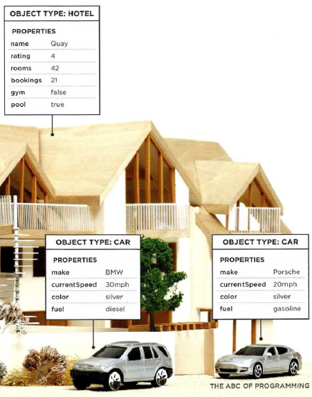

# Html And JS
## Html:
- HTML is the standard markup language for Web pages
And with HTML you can create your own Website.
before we look at the code used to build websites it is important to consider the different ways in which people access the web.
### Browsers:
People access websites using
software called a web browser.
### Web Servers:
When you ask your browser for
a web page, the request is sent
across the Internet to a special
computer known as a web server which hosts the website.
### Screen readers:
Screen readers are programs
that read out the contents of a
computer screen to a user.
### Devices
People are accessing websites
on an increasing range of devices
including desktop computers,
laptops, tablets, and mobile
phones.

- ## HTML use elements to desribe the structure of pages:

Like this image:

---------------

`<body>`

You met the `<body>` element
in the first example we created.
Everything inside this element is
shown inside the main browser
window.

`<head>`

Before the `<body>` element you
will often see a `<head>` element.
This contains information
about the page (rather than
information that is shown within
the main part of the browser
window that is highlighted in
blue on the opposite page).
You will usually find a `<title>`
element inside the `<head>`
element.

`<title>`

The contents of the `<title>`
element are either shown in the
top of the browser, above where
you usually type in the URL of
the page you want to visit, or
on the tab for that page (if your
browser uses tabs to allow you
to view multiple pages at the
same time).

## DOCTYPES:

Because there have been
several versions of HTML, each
web page should begin with a
DOCTYPE declaration to tell a
browser which version of HTML
the page is using.

## Comments:

If you want to add a comment
to your code that will not be
visible in the user's browser, you
can add the text between these
characters:
`<!-- comment goes here -->`

## ID Attribute:

Every HTML element can carry
the id attribute. It is used to
uniquely identify that element
from other elements on the
page

## Class Attribute:

Every HTML element can
also carry a class attribute.
Sometimes, rather than uniquely
identifying one element within
a document, you will want a
way to identify several elements
as being different from the
other elements on the page.

## Block Elements:

Some elements will always
appear to start on a new line in
the browser window. These are
known as block level elements.

## Inline Elements:

Some elements will always
appear to continue on the
same line as their neighbouring
elements. These are known as
inline elements.

## Grouping Text & Elements In a Block:

The `
` element allows you to
group a set of elements together
in one block-level box.

## Grouping Text & Elements Inline:

The `` element acts like
an inline equivalent of the `
`
element. It is used to either

## Iframe:

An iframe is like a little window
that has been cut into your
page — and in that window you
can see another page. The term
iframe is an abbreviation of inline
frame.

## meta :

`<meta>`

The `<meta>` element lives
inside the `<head>` element and
contains information about that
web page.

## New Html 5 Layout Elements:
**Headers & Footers :**

The `<header>` and `<footer>`
elements can be used for:
●● The main header or footer
that appears at the top or
bottom of every page on the
site.
●● A header or footer for an
individual `<article>` or
`<section>` within the page

**Navigation:**

The `<nav>` element is used to
contain the major navigational
blocks on the site such as the
primary site navigation.

**Articles:**

The `<article>` element acts as
a container for any section of a
page that could stand alone and
potentially be syndicated.

**Asides:**

The `<aside>` element has two
purposes, depending on whether
it is inside an `<article>`
element or not.

**Sections**

The `<section>` element groups
related content together, and
typically each section would
have its own heading.

**Heading Groups**
The purpose of the `<hgroup>`
element is to group together a
set of one or more `<h1>` through
`<h6>` elements so that they are
treated as one single heading.

---------------
## JavaScript:

- JavaScript can be used in browsers to make websites more interactive,
interesting, and user-friendly.

### The main concepte should we know before learn how to write JS: 

**What is a script and how do I create one?**

A script is a series of instructions that a computer can follow to achieve a goal.

**How do computers fit in with the world around them?** 

Here is a model of a hotel, along with some model trees, model people,
and model cars. To a human, it is clear what kind of real -world object
each one represents.

** How do I write a script for a web page? **

### OBJECTS & PROPERTIES:

People access websites using
software called a web browser.

- Objects is a (Things)

- Properties is a (Characteristics)

**EVENTS**
In the real world, people interact with objects. These interactions can
change the values of the properties in these objects.
**Ex**
• The accelerator makes the car go faster
• The brake slows it down

