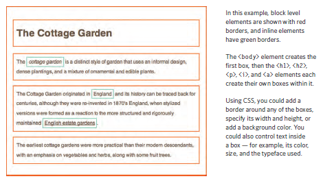
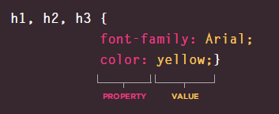
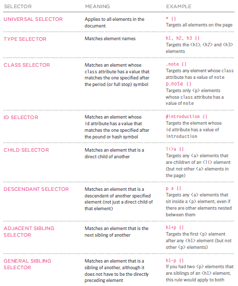
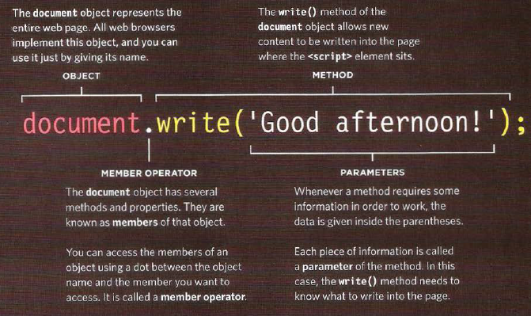
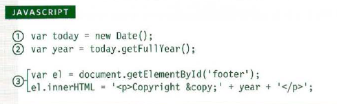
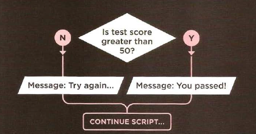
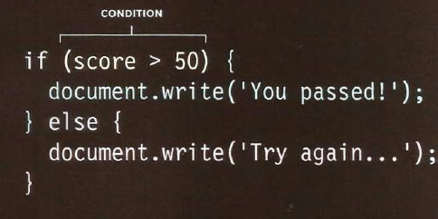

# Html Css, And JS
## Html:
- Headings: 

`<h1>`
`<h2>`
`<h3>`
`<h4>`
`<h5>`
`<h6>`
HTML has six "levels" of
headings:
`<h1>` is used for main headings
`<h2>` is used for subheadings

- Paragraph:

`
`
To create a paragraph, surround
the words that make up the
paragraph with an opening `
`
tag and closing `
` tag.

- Bold & Italic:

`<b>`
By enclosing words in the tags
`<b>` and `</b>` we can make
characters appear bold.

`<i>`
By enclosing words in the tags
`<i>` and `</i>` we can make
characters appear italic.

- Superscript & Subscript:

``
The `` element is used
to contain characters that
should be superscript such
as the suffixes of dates or
mathematical concepts like
raising a number to a power such
as 22.
``
The `` element is used to
contain characters that should
be subscript. It is commonly
used with foot notes or chemical
formulas such as H20.

- Line Breaks & Horizontal Rules:

` `
As you have already seen, the
browser will automatically show
each new paragraph or heading
on a new line. But if you wanted
to add a line break inside the
middle of a paragraph you can
use the line break tag ` `.

`
`
To create a break between
themes — such as a change of
topic in a book or a new scene
in a play — you can add a
horizontal rule between sections
using the `
` tag.

- Strong & Emphasis:

`<strong>`
The use of the `<strong>`
element indicates that its
content has strong importance.
For example, the words
contained in this element might
be said with strong emphasis.

`<em>`
The `<em>` element indicates
emphasis that subtly changes
the meaning of a sentence.

- Quotations: 

`<blockquote>`
The `<blockquote>` element is
used for longer quotes that take
up an entire paragraph. Note
how the `
` element is still
used inside the `<blockquote>`
element.

`<q>`
The `<q>` element is used for
shorter quotes that sit within
a paragraph. Browsers are
supposed to put quotes around
the `<q>` element, however
Internet Explorer does not —
therefore many people avoid
using the `<q>` element.

- Abbreviations & Acronyms:

`<abbr>`
If you use an abbreviation or
an acronym, then the `<abbr>`
element can be used. A title
attribute on the opening tag is
used to specify the full term.

- Citations & Definitions:

`<cite>`
When you are referencing a
piece of work such as a book,
film or research paper, the
`<cite>` element can be used
to indicate where the citation is
from.

`<dfn>`
The first time you explain some
new terminology (perhaps an
academic concept or some
jargon) in a document, it is
known as the defining instance
of it.

## CSS:

CSS stands for Cascading Style Sheets
css can make your web pages more attractive.

CSS allows you to create rules that control the way that each individual box.

**BLOCK & INLINE ELEMENTS**

**CSS Properties Affect How Elements Are Displayed**

**Properties** indicate the aspects
of the element you want to
change. For example, color, font,
width, height and border.

**Values** specify the settings
you want to use for the chosen
properties. For example, if you
want to specify a color property
then the value is the color you
want the text in these elements
to be.

### We can use CSS by 3 ways:

- Inline, internal and External.

### Selector:

----------------------

## JS
### How to use Objects & Methods:

- ## STATEMENTS:

A script is a series of instructions that a computer can follow one-by-one.
Each individual instruction or step is known as a statement.
Statements should end with a semicolon.

> var today= new Date();

## COMMENTS:

You should write comments to explain what your code does.

> /* like this */

##  VARIABLE?:

A script will have to temporarily
store the bits of information it
needs to do its job. It can store this
data in variables.

How to declare:
> let greeting;

How to assign them a value:
> greeting= "Welcome";

## Data Types:

- JavaScript distinguishes between **numbers**,**strings**, and **true or false values known as Booleans**.

## Date Object:

## FUNCTIONS, METHODS & OBJECTS:

- Functions allow you to group a set of related statements together that represent a single task.

- Functions can take parameters and may return a value.

- An object is a series of variables and functions that represent something from the world around you.

- In an object, variables are known as properties of the object; functions are known as methods of the object.

- JavaScript also has several built-in objects such as String, Number, Math, and Date. Their properties and methods offer functionality that help you write scripts.

- Arrays and objects can be used to create complex data
sets (and both can contain the other).

## Decison Making:

- In JS there scriot where decision are made that determin which lines of code should be run next.

## Evaluation condition And conditional statement:

- There are two components to a decision: 
1: An experssion is evaluated, thich returns a value.
2: A conditional statement says what to do in a given situation.

## Comparison operators: evaluation conditions:

Given that x = 5
 	 	 	
| Operator      | Description | Comparing | Returns|
| -------------- | ----------- | ---------- | -------- |
| == | equal to | x == 8  | false |
| === | equal value and equal type | x === "5" | false |
| != | not equal | x != 8 | true |
| !== | not equal value or not equal type | x !== 5 | false |
| >  |   greater than | x > 8 | false
| <  |   less than | x < 8 | true |
| >=  |   greater than or equal to | x >= 8 | false |
| <=  |   less than or equal to | x <= 8 | true |

