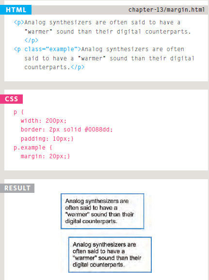
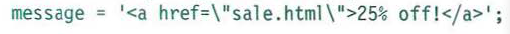
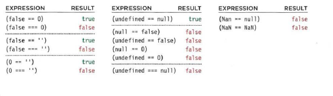
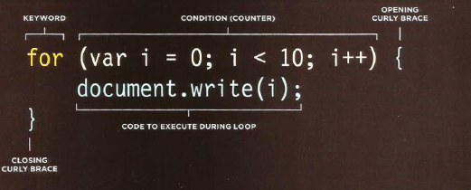

# HTML Lists, Control Flow with JS, and the CSS Box Model
## HTML Lists:
### HTML provides us with three different types to use lists: 

- **Ordered**:

`<ol>`
The ordered list is created with
the `<ol>` element.

`<li>`
Each item in the list is placed
between an opening `<li>` tag
and a closing `</li>` tag. (The li
stands for list item.)
- **Unordered**:

`<ul>`
The unordered list is created
with the `<ul>` element.
- **Definition**:

`<dl>`
The definition list is created with
the `<dl>` element and usually
consists of a series of terms and
their definitions.
Inside the `<dl>` element you will
usually see pairs of `<dt>` and
`<dd>` elements.
`<dt>`
This is used to contain the term
being defined (the definition
term).
`<dd>`
This is used to contain the
definition.

## CSS Box:
- How we use it:

Control the dimensions of your boxes:By useing `width`,  `height`, `min-width`, `max-width`, `min-height`, `max-height`.

Create borders around boxes: By useing : `border-width`, `border-style` , `border-color`, .

Set margins and padding for boxes, By useing: `padding`, `margin`.

Show and hide boxes, By useing: `display`, `hidden`, `visible`.




-------------

## JS:

### QUOTES:

Sometimes you will want to use a double or single quote mark within a string.



## COMPARING TWO EXPRESSIONS

let cop=(4+3) > (7+0)

## Logical Operators:

```
| Operator | Description | Comparing                   |
| ---------| ------------| --------------------------- |
|    &&    |    and      | (x < 10 && y > 1) is true   |
|    ||    |    or       | 	(x == 5 || y == 5) is false|
|    !=    |    not      | !(x == y) is true           | 
```
## IF .. ELSE Statements:

```
if(condition){
    code;
}else{
    another code;
}
```
##  Switch Statements:

```
switch(level){
    case "one":
        title="level 1";
        break;

    case "two":
        title="level 2";
        break;
    
    default:
        title=" ";
        break;
}

```

## Checking Equality & Existence:




## Loops:




