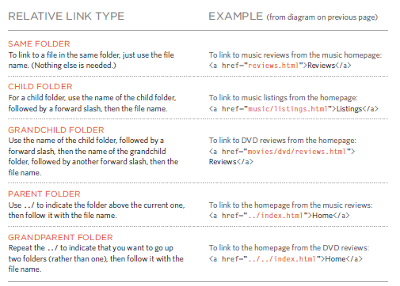

# HTML Links, JS Functions, and Intro to CSS Layout
## HTML Links:
### HTML provides us to allow to mov from one page to another: 

> `< a href="http://www.google.jo">GOOGLE</a>`

If you want a link to open in a new window, you can use the
target attribute on the opening `<a>` tag. The value of this attribute should be _blank.

> `< a href="http://www.google.jo" target="_blank">GOOGLE</a>`

## HTML Layout:
Controlling the position of elements:

- Normal Flow

`position:static`: each block-level
element sits on top of the next one.

- Relative Positioning

`position:relative`:
Relative positioning moves an
element in relation to where it would have been in normal flow.

- Absolute Positioning 

`position:absolute`: 
When the position property
is given a value of absolute,
the box is taken out of normal
flow and no longer affects the
position of other elements on
the page. (They act like it is not there.)

- Fixed Positioning

`position:fixed`: Fixed positioning is a type
of absolute positioning that
requires the position property
to have a value of fixed.

- Overlapping Elements

`z-index`: When you use relative, fixed, or absolute positioning, boxes can overlap. If boxes do overlap, the elements that appear later in the HTML code sit on top of those that are earlier in the page.

- Floating Elements

`float`: The float property allows you to take an element in normal flow and place it as far to the left or right of the containing element as possible.

- Clearing Floats

`clear`: The clear property allows you to say that no element (within the same containing element) should touch the left or righthand
sides of a box. It can take
the following values: `left`,`right`,`both`,`none`

--------------

## JS Functions

### Function and Methods:

Functions consist of a series of statements.

A method is the same as a function, except methods are created inside (and are part of) an object.

>  `funtion userName(){ let userName: promet("Plz enter your name: "); alert("Welcome to my page "+ username);}`

Then you shpuld call it:

> `userName();`

## 6 Reasons for Pair Programming

Pair Programming mean : more “two heads are better than one” than “stop reading over my shoulder,” pair programming is the practice of two developers sharing a single workstation to interactively tackle a coding task together.

### Why :

- Greater efficiency:
Then 2 Programmers work on the same code it is easier to catch mistakes in the making

- Engaged collaboration:
Then 2 Programmers work on the same code, the experience is more engaging and both programmers are more focused than if they were working alone. It is harder to procrastinate or get off track when someone else is relying on you to complete the work.

- Learning from fellow students:
Everyone has a different approach to problem solving; working with a teammate can expose developers to techniques they otherwise would not have thought of.

- Social skills:
Pair programming is great for improving social skills and improves programming skills.

- Job interview readiness:
They will carry out exercises together, such as code challenges, building a project or feature, or debugging an existing code base. By doing so, companies can get a better feel for how an applicant will fit into the team and their collaboration style.

- Work environment readiness:
Many companies that utilize pair programing expect to train fresh hires from CS-degree programs on how they operate to actually deliver a product. Code Fellows graduates who are already familiar with how pairing works can hit the ground running at a new job, with one less hurdle to overcome.