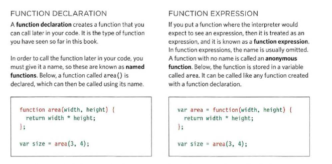
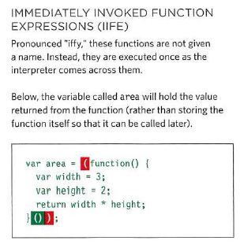
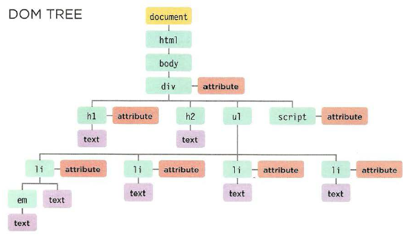
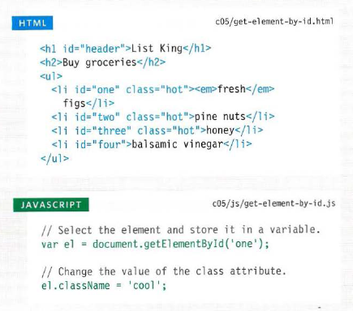

# JS Object Literals; The DOM
## Understanding The Problem Domain Is The Hardest Part Of Programming:

What is the hardest thing about writing code?

There are many common answers to this question:

    1-Learning a new technology
    2-Naming things
    3-Testing your code
    4-Debugging
    5-Fixing bugs
    6-Making software maintainable

### A familiar problem:

-What I found with this simple application was that because it was so easy to understand, the focus was taken off of the problem domain and put instead on the technology.

-By creating a familiar problem domain, I found that both the tasks of me teaching a new technology and the viewer learning that technology were much easier, because it is very difficult to learn more than one thing at once.

----------------

## Type of function:
- ### Function declartion And expression:

- ### Immediately invoked function expressions(IIFE) :

--------------------------

 ## Document Object Model (DOM):

To specifies how browsers should create a model of an HTML page and how JavaScript can access and update the
contents of a web page while it is in the browser window.

## DOM tree 
> `<html>`   
`<body>`   
`
`    
`<hl id="header">List</hl>`   
`<h2>Buy groceries</h2>`   
`<ul>`   
`<li id="one" class="hot"><em>fresh</em> figs</li>`    
`<li id="two" class="hot">pine nuts</li>`   
`<li id="three" class="hot">honey</li>`   
`<li id="four">balsamic vinegar</li>`   
`</ ul>`     
`<script src="js/l i st. js "></scri pt>`    
`</ div>`    
`</body>`    
`</html>`   

### Access the element:
`getElementById()`   
`querySelector()`  
`getElementsByClassName()`     
`getElementsByTagName()`     
`querySelectorAll()`     

### Work with those elements:

`var item= getElementById('one');`

> 

----------------------

