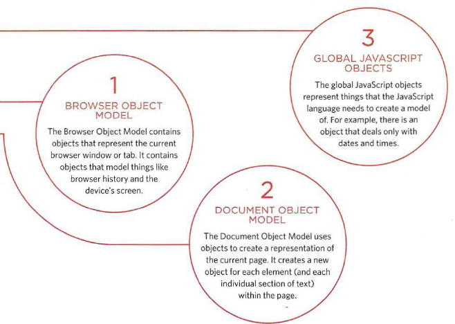

# HTML Tables; JS Constructor Functions; And Domain Modeling
## HTML Tables:

There are several types of information that need to be displayed in a grid or table
There are many common  nswers to this question:

`<table>`, `<tr>`,`<th>`, `<td>`, `<td>`

>`<table>`    
`<tr>`    
`<th></th>`    
`<th scope="col">Saturday</th>`    
`<th scope="col">Sunday</th>`    
`</tr>`   
`<tr>`      
`<th scope="row">Tickets sold:</th>`   
`<td>120</td>`  
`<td>135</td>`  
`</tr>`   
`<tr>`  
`<th scope="row">Total sales:</th>`  
`<td>$600</td>`  
`<td>$675</td>`  
`</tr>`  
`</table>`  

### Constructor Functions:

There is two way to create an object:

LITERAL NOTATION

> `var hotel = {`  
`name: 'Quay' ,`  
`rooms: 40,`  
`booked: 25,`  
`checkAvailability: function() {`    
`return this.rooms - this .booked;}`  
`} ;`

OBJECT CONSTRUCTOR NOTATION
> 
`function Hotel(name, rooms, booked) {`  
`this.name = name;`  
`this.rooms = rooms;`  
`this.booked = booked;`  
`this.checkAvailability = function()`  
`return this.rooms-this.booked;`  
`} ;`  
`var quayHotel =new Hotel('Quay', 40 , 25);`  
`var parkHotel =new Hotel('Park', 120, 77);`

## WHAT ARE BUILT-IN OBJECTS?

Browsers come with a set of built-in objects that represent things like the browser window and the current web page shown in that window. These built-in objects act like a toolkit for creating interactive web pages.

The 3 main Built-In object:

----------------

## Domain Modeling: 
Domain modeling is the process of creating a conceptual model in code for a specific problem. A model describes the various entities, their attributes and behaviors.

 1- When modeling a single entity that'll have many instances, build self-contained objects with the same attributes and behaviors.

2- Model its attributes with a constructor function that defines and initializes properties.

3- Model its behaviors with small methods that focus on doing one job well.

4- Create instances using the `new` keyword followed by a call to a constructor function.

5- Store the newly created object in a variable so you can access its properties and methods from **outside**.

7- Use the `this` variable within methods so you can access the object's properties and methods from **inside**.

