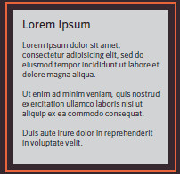
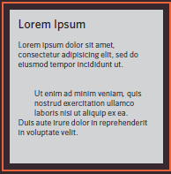
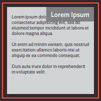
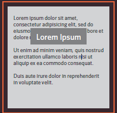
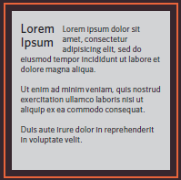

# CSS Layout
## Layout:

CSS its allows you to style and design the content on your page and how to control where each element sits on a page.

### **Key Concepts in Positioning Elements:**
------

**Building Blocks:**

CSS treats each HTML element as if it is in its own box. This box will either be a block-level
box or an inline box.

**Containing Elements:**

If one block-level element sits inside another block-level element then the outer box is
known as the containing or parent element.

### **Controlling the Position of Elements:**
CSS has the following positioning schemes that allow you to control the layout of a page: normal flow, relative positioning, and absolute positioning. You specify the positioning scheme using the position property in CSS. You can also float elements using the float property.

**Normal flow:**

Every block-level element
appears on a new line.

**Relative Positioning:**

This moves an element from the
position it would be in normal
flow.

**Absolute positioning:**

This positions the element
in relation to its containing
element.

**Fixed Positioning:**

This is a form of absolute
positioning that positions
the element in relation to the
browser window.

**Floating Elements:**

Floating an element allows
you to take that element out
of normal flow and position
it to the far left or right of a
containing box.

-------------------

- Normal Flow

`position:static`: each block-level
element sits on top of the next one.

- Relative Positioning

`position:relative`:
Relative positioning moves an
element in relation to where it would have been in normal flow.

- Absolute Positioning 

`position:absolute`: 
When the position property
is given a value of absolute,
the box is taken out of normal
flow and no longer affects the
position of other elements on
the page. (They act like it is not there.)

- Fixed Positioning

`position:fixed`: Fixed positioning is a type
of absolute positioning that
requires the position property
to have a value of fixed.

- Overlapping Elements

`z-index`: When you use relative, fixed, or absolute positioning, boxes can overlap. If boxes do overlap, the elements that appear later in the HTML code sit on top of those that are earlier in the page.

- Floating Elements

`float`: The float property allows you to take an element in normal flow and place it as far to the left or right of the containing element as possible.

- Clearing Floats

`clear`: The clear property allows you to say that no element (within the same containing element) should touch the left or righthand
sides of a box. It can take
the following values: `left`,`right`,`both`,`none`

--------------

