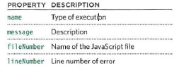
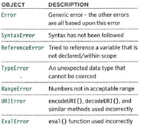

# JS Debugging:

When writing a long script, nobody gets everything right in their first attempt. 

So Debugging is the process of finding errors. It involves a
process of deduction.

The error messages that a browser gives look cryptic at first, but they can help you determine what
went wrong in your JavaScript and how to fix it. In this chapter you will learn about:

**THE CONSOLE & DEV TOOLS :**

- Tools built into the browser that help you hunt for errors.

**COMMON PROBLEMS :**

- Common sources of errors,
and how to solve them.

**HANDLING ERRORS :**

- How code can deal with potential errors gra cefully.

-------------------

**ORDER OF EXECUTION :**

- To find the source of an error, it helps to know how scripts are processed.

- The order in which statements are executed can be complex.

**EXECUTION CONTEXTS :**

- The JavaScript interpreter uses the concept of execution contexts.

**THE STACK :**

- The JavaScript interpreter procesesses one line of code at a time.

JavaScript has 7 different types of errors. Each creates
its own error object, which can tell you its line number
and gives a description of the error.

---------

### **ERROR OBJECTS :**

- Error objects can help you find where your mistakes are and browsers have tools to help you read them.

When an Error object is created, it will contain the following properties:

- There are seven types of built-in error objects in JavaScript:

-------

### **HOW TO DEAL WITH ERRORS :**

**1: DEBUG THE SCRIPT TO FIX ERRORS**

**2: HANDLE ERRORS GRACEFULLY**

### **Console Object :**

Browsers that have a console have a `console` object, which has several
methods that your script can use to display data in the console.
The object is documented in the Console API. 

- `console.info()` : 
 can be used for general information.

- `console.warn()` :
 can be used for warnings

- `console.error()` : 
  can be used to hold errors.

- `console.group()` :
  groups messages together

- `console.table()` : 
outputs a table showing objects and arrays.

- `console.assert()` :
test if a condition is met and write to the console only if evaluates to false

